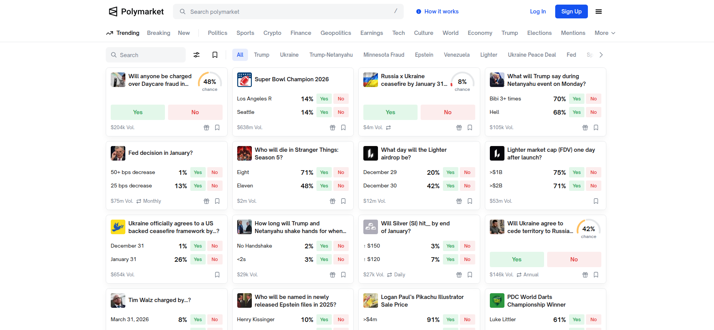

#NewslyJS - Analyze and Rank Polymarket



Disclaimer:

1. NewslyJS takes NO responsibility of any financial losses for betting using NewslyJS.

2. NewslyJS is just an analytical tool that helps you understand news and polymarket events better. 

3. NewslyJS uses OpenAI model GPT-4.1 and can be wrong, NewslyJS is meant only as a analytical tool not as the sole basis for your betting choice.

overview: 

NewslyJS is a hybrid free and for profit package that analyzes and ranks likelihoods per question from a given event, searches from a event's name, gets questions from polymarket events.

NewslyJS allows you to enter any event link from polymarket e.g ```https://polymarket.com/event/will-anyone-be-charged-over-daycare-fraud-in-minnesota?tid=1767016579365``` or just a name e.g ```will-anyone-be-charged-over-daycare-fraud-in-minnesota```. 

the ranking function and API ```poly_ranking``` requires API key that costs a onetime payment of $1.99 (unless you lose your key, no refunds)


buyer link for the API key (onetime $1.99 payment for unlimited calls): https://buy.stripe.com/5kQ3cu3YS31t1G00le6kg05


How to use: 

1. ```npm install newslyjs``` 

2. ```ìmport Newsly from 'newslyjs'```

3. ```const obj = new Newsly()```

poly_ranking requires a API key (poly_questions and poly_searches are free): 

1. link to buy a key: https://buy.stripe.com/5kQ3cu3YS31t1G00le6kg05


NewslyJS Multiple APIs And Functions: 

1. poly_questions - Get every question from the event in JSON format (Free) 
    
2. poly_searches - Uses multiple search engines to get search data from the event in JSON format (Free).

3. poly_ranking - Uses both APIs to rank the every question based on likelihood from the event (Buy The API Key For $1.99 / Unlimited Calls).


pricing:

1. poly_questions = Free

2. poly_searches = Free

3. poly_ranking = $1.99 API key for unlimited calls


Function list: 

link = "https://polymarket.com/event/russia-x-ukraine-ceasefire-by-january-31-2026?tid=1767005817776"

1. console.log(await obj.poly_questions(link))

2. console.log(await obj.poly_searches(link))
 
3. console.log(await obj.poly_ranking(link, {apikey: "your_key"}))
 

The function's argument options: 

1. the event name (after /event/ but before the query ? like ```russia-x-ukraine-ceasefire-by-january-31-2026)```)

2. the full link like ```https://polymarket.com/event/russia-x-ukraine-ceasefire-by-january-31-2026?tid=1767005817776```


Disclaimer:

1. NewslyJS takes NO responsibility of any financial losses for betting using NewslyJS.

2. NewslyJS is just an analytical tool that helps you understand news and polymarket events better. 

3. NewslyJS uses OpenAI model GPT-5 and can be wrong, NewslyJS is meant only as a analytical tool not as the sole basis for your betting choice.